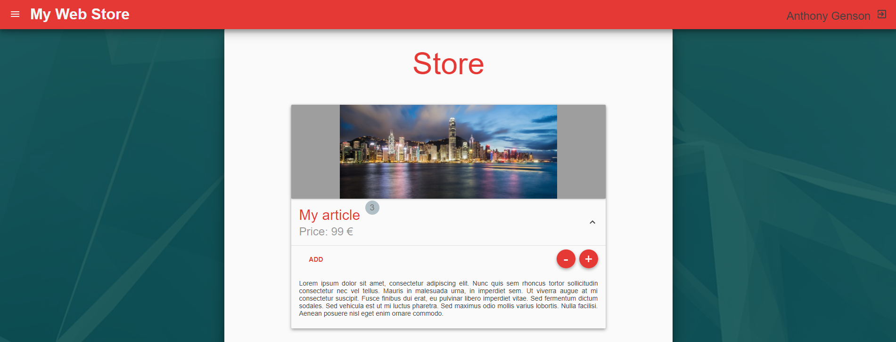

# react-project-web-store

Web project based on React / Redux, to create a simple web store.

**This project is based on [react](https://github.com/facebook/react), using:**
- [react-router](https://github.com/ReactTraining/react-router)
- [redux](https://github.com/reactjs/redux)

# Description

First time using react, here's a small react project consisting on creating a web store.

This is only a static website developement. It is not connected to any data storage, it just simulates one.

Here's the website instance, thanks to [surge](http://surge.sh/) (free static web publishing): [http://react-project-web-store.surge.sh](http://react-project-web-store.surge.sh)

# Features

Features:
- Login page (sign in / up)
- Inventory management
- Web Store (client side)
- Cart management & Order

Tools:
- [React](https://github.com/facebook/react) for the structure of the website
- [Redux](https://github.com/reactjs/redux) for local storage (products, cart, paths & users)
- [React-router](https://github.com/ReactTraining/react-router) for paths management
- [Material-ui](https://github.com/mui-org/material-ui) for design
